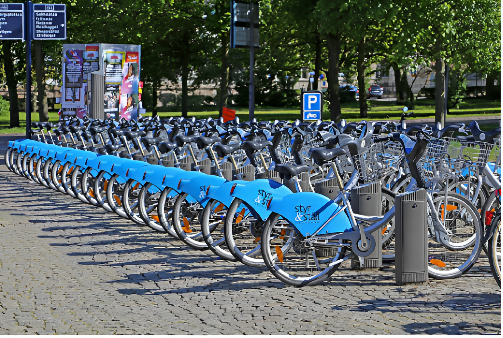

# nonso-s-portfolio
Data Analytics
# [Project 1: Google Data Analytics Capstone Case Study: Cyclistic Bike-Share Analysis](https://rpubs.com/Nonso_techish/966457)

---

## Introduction

This Is a Capstone Project: Case study that was completed as the final project for the Google Data Analytics Professional Certificate course. The Project is about a fictional Cyclistic Bike Share Company. the project is to analyze and derive insights to answer crucial questions and help the stakeholders make data driven decisions.

## Project Overview
* This is a project aimed at **converting Casual riders to Annual members**
* Analyzised and visualized How Annual members and Casual riders use Cyclistic bikes differently. 
* Used R programming language to analyzise and Visualize the data
* Used R markDown for report and documentation
* cleaned, manipulated and transformed data using  Excel Spreadsheet and R Programming language
* I gave recommendations and conclusions to help the stakeholders make data driven decisions 
* used the previous 6 months (**September 2021 – february 2022**)  of cyclistic trip data
* the dataset was downloaded from [here]( https://divvy-tripdata.s3.amazonaws.com/index.html)
